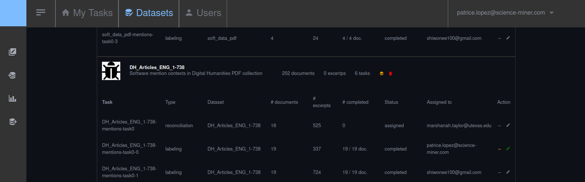
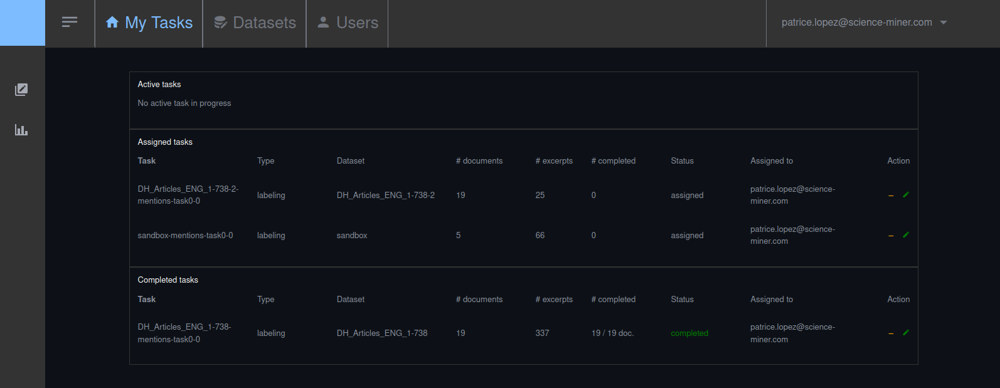
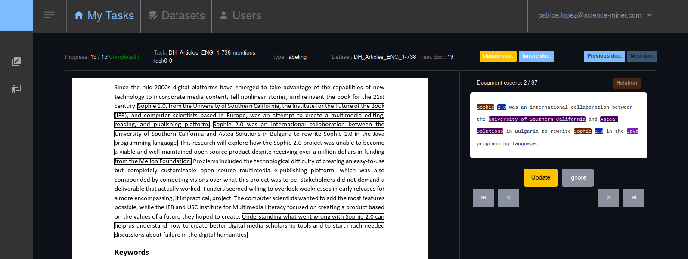
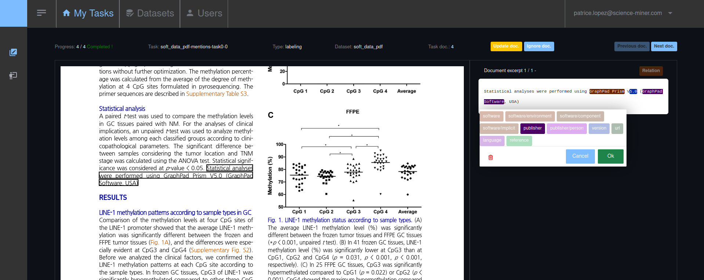
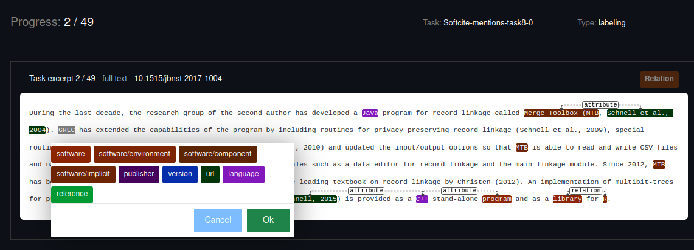
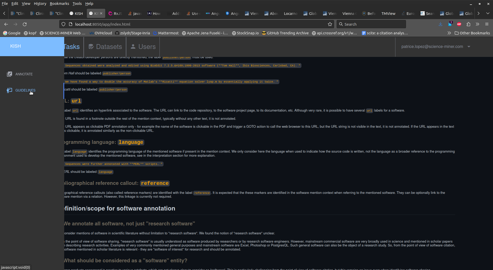
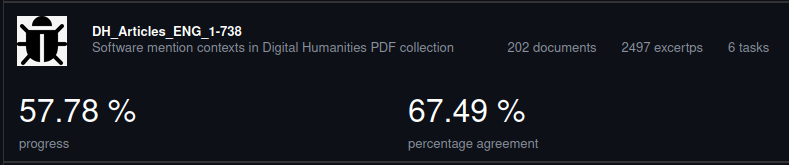

# KISH

__Keeping It Simple is Hard__

__Work in progress !__

## Introduction

The main goal of this web application is to facilitate and improve the quality of manual annotation of PDF documents (the current scholar publishing standard), by synchronizing PDF and structured extracted content. Annotation of PDF can go beyond bounding boxes or text selection directly on the PDF text layer, which are both imprecise and subject to multiple layout and text quality issues.

The technical approach ofthis application is kept volontary relatively simple, without any database to install/run. The application is a Python FastAPI backend service combined with an Angular web application. The tool uses an embedded SQLite database. Every back-end actions (including authentication) is realized via a REST API. Angular services connect the web components to this API.

**Back-end:** Python 3.7+, FastAPI, fastapi-users (for secure authentication), SQLITE, sqlalchemy

**Front-end:** Angular 16.2, PDF.js, Bootstrap 5, recogito-js (and still some remaining JQuery meant to disappear)

Secure authentication requires to indicate SMTP settings (for email after password reset) and OAuth2 log-in requires client credentials depending on the OAuth service where to redirect the user. Data import/export format is JSON only. Annotation guidelines should be written in markdown and put under `resources/data/markdown/`. 

The Bootstrap front-end components are derived from the [Sleek theme](https://github.com/themefisher/sleek) (MIT license).

## Functionalities

1. Manage list of datasets and annotation tasks:



2. Manage multi-stage user annotation tasks (with reconciliation phase):



3. Support direct PDF annotations, as well as excerpt classification and annotations:







Guidelines can be associated to tasks and available during 



PDF and excerpts can be pre-annotated. 

4. Support user authentication, annotator/curator/admin roles

5. Inter-Annotator Agreement for datasets are calculated automatically based on redundant tasks: 



Import and export of dataset and annotations are currently realized with python command lines using JSON (more to come). 

## Requirements and install

### Backend

The present tool is implemented in Python for its backend part, and should work correctly with Python 3.7 or higher. 

Get the github repo:

```console
git clone https://github.com/kermitt2/kish
cd kish
```

It is strongly advised to setup first a virtual environment to avoid falling into one of these gloomy python dependency marshlands - you can adjust the version of Python to be used, but be sure to be 3.7 or higher:

```console
virtualenv --system-site-packages -p python3.8 env
source env/bin/activate
```

Install the dependencies:

```console
python3 -m pip install -r requirements.txt
```

Finally install the project in editable state

```console
python3 -m pip install -e .
```

### Frontend

The web application requires [Angular](https://angular.io) installed on your local system, for this you need `Node.js` and `npm` package manager. Then install Angular and the javascript dependencies:

```
cd kish/app
npm install
```

### Start the service

The **KISH API service** is implemented with [FastAPI](https://fastapi.tiangolo.com) and can be started as follow on default port `8050`:  

```console
python3 kish/service.py --config my_config.yml
```

The application is then available for sign-in at `http://localhost:8050/app/sign-in.html`. 

`my_config.yml` is the configuration file for the application, you can start with the default `config.yml`, but setting at least an admin account is preferable. By default, at first launch, an admin account is created with login `admin@admin.com` and password `administrator`. You should set a proper admin account in the `config.yml` file:

```yaml
# default admin super-user when not already existing, admin_email must be an email and password must be kept secret 
  admin: "admin@admin.com"
  admin_password: "admin"
```

The admin has then the rights to manage users and extra fonctionalities in the web application. 


The **KISH web application** is implemented with [Angular](https://angular.io) and can be strated as follow on the default port `4200`:

```
ng serve
```

By default, open the application at `http://localhost:4200`

### Use the web API services

Once the service is started as described in the previous sections, the API root point is by default `http://localhost:8050`, so for instance:

```console
> wget http://localhost:8050/alive
```

The web service API documentations are available at `http(s)://*host*:*port*/docs`, e.g. for instance `http://localhost:8050/docs`, based on Swagger, and `http://localhost:8050/redoc` for ReDoc documentation style. These documentations offer interactive support to support test queries. 


### Configure the service

A default configuration is set in `config.yml`, but it has to be completed for setting new host/port for the services and other deployment options. Sensitive/secret information are managed currently in the configuration file. 

## License

KISH is distributed under [Apache 2.0 license](http://www.apache.org/licenses/LICENSE-2.0). 

The documentation of the project is distributed under [CC-0](https://creativecommons.org/publicdomain/zero/1.0/) license. 

If you contribute to the KISH project, you agree to share your contribution following these licenses. 

Contact: Patrice Lopez (<patrice.lopez@science-miner.com>)
